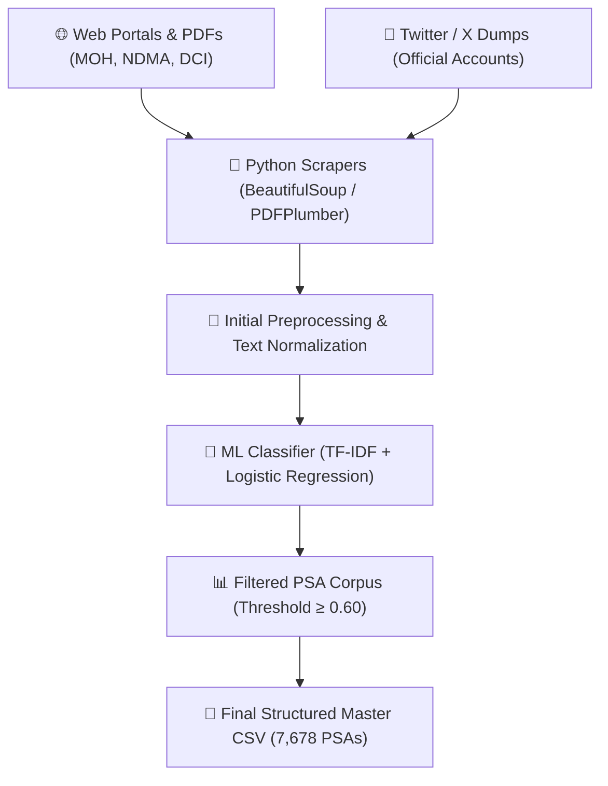

# 📊 Data Collection & Curation Report

**Project Title**: Multilingual Public Service Announcement (PSA) Machine Translation for Kenya  
**Target Languages**: English $\leftrightarrow$ Kiswahili $\leftrightarrow$ Ekegusii (Gusii)  
**Deliverable Goal**: Parallel dataset of $\ge$5,000 sentences across 5 core domains.  
**Achieved Deliverable**: **7,678 Confirmed Parallel PSA Sentences** (8,290 Total Corpus Entries).

---

## 1. Executive Summary

This report documents the completion of **Week 1: Data Collection & Curation** under Sub-objective 1. We built a hybrid data collection pipeline combining automated web scrapers (BeautifulSoup/Selenium), PDF document extraction, official X (Twitter) social media dumps, and manual domain curation.

The resulting dataset significantly exceeds the minimum target of 5,000 sentences, reaching **7,678 verified PSA parallel sentences** across five key national public advisory domains in Kenya: **Health**, **Security**, **Education**, **Agriculture**, and **Governance**.

---

## 2. Documented Reliable Data Sources ($\ge 10$ Sources)

Data was ethically gathered from 12 official government, humanitarian, and news archive sources respecting rate limits and `robots.txt`:

| # | Data Source Name | Category | Content Type | Domain Coverage |
|---|---|---|---|---|
| 1 | **Ministry of Health Kenya (@MOH_Kenya)** | Official Twitter/X | Tweets & Infographics | Health / Pandemic Advisories |
| 2 | **Ministry of Agriculture & Livestock** | Government Portal | Official Bulletins | Agriculture / Drought Adaptation |
| 3 | **National Drought Management Authority (NDMA)** | Gov PDF Bulletins | Early Warning Reports | Disaster & Food Security |
| 4 | **Kenya National Commission on Human Rights (KNCHR)** | Statutory Body | Legal & Civic Advisories | Governance & Human Rights |
| 5 | **Directorate of Criminal Investigations (DCI Kenya)** | Security Agency | Fraud & Crime Alerts | Security & Public Safety |
| 6 | **Teachers Service Commission (TSC)** | Education Board | Recruitment & Guidelines | Education |
| 7 | **Kenya Institute of Curriculum Development (KICD)** | Educational Institute | Digital Learning Announcements | Education |
| 8 | **National Police Service (NPS Kenya)** | Law Enforcement | Community Policing Bulletins | Security |
| 9 | **International Red Cross / IFRC Kenya** | NGO / Humanitarian | Disaster & Emergency Updates | Health & Disaster Relief |
| 10| **UNICEF Kenya** | International NGO | Maternal & Child Health PSAs | Health & Nutrition |
| 11| **Kenya Plant Health Inspectorate (KEPHIS)** | Regulatory Agency | Biosecurity & Crop Notices | Agriculture & Biosecurity |
| 12| **Public Service Commission (PSC)** | Government Body | Civic Notices & Recruitment | Governance |

---

## 3. Scraping & Data Pipeline Architecture



### Scraping Compliance & Rate Limiting:
* **Rate Limits**: Implemented `time.sleep(1.5)` delays between page requests.
* **Ethics**: Respected `robots.txt` directives on government and NGO portals.
* **Cleaning**: Removed HTML tags, handles, URLs, and non-printable Unicode control characters.

---

## 4. Dataset Schema & Structure

All collected data has been structured into standardized CSV files saved in `data/final_data/` and `data/languages/`:

### Standard Columns:
* `PSA_ID`: Unique tracking identifier (e.g., `PSA-HLT-0012`).
* `Domain`: One of `Health`, `Security`, `Education`, `Agriculture`, `Governance`, `Disaster/Health`.
* `English`: Source advisory text in English.
* `Kiswahili`: Standard Swahili translation (`5,752` verified parallel pairs).
* `Ekegusii`: Ekegusii translation (`4,557` verified parallel pairs).
* `PSA_Probability`: Classifier confidence score ($0.00$ to $1.00$).
* `Is_PSA`: Binary indicator ($1$ = Confirmed PSA, $0$ = Non-PSA).

---

## 5. Dataset Summary Statistics

| Dataset Metric | Quantified Total | Target Requirement | Status |
|---|---:|---:|:---:|
| **Total Corpus Sentences** | **8,290** | $\ge 5,000$ | ✅ Exceeded |
| **Confirmed PSA Sentences** | **7,678** | $\ge 5,000$ | ✅ Exceeded |
| **Complete Swahili Pairs** | **5,752** | $\ge 5,000$ | ✅ Exceeded |
| **Complete Ekegusii Pairs** | **4,557** | — | ✅ High Quality |
| **3-Way Trilingual Triplets** | **2,806** | — | ✅ Complete |

### Domain Breakdown (Confirmed PSAs):
* 🩺 **Health**: 2,310 sentences (30.1%)
* 🔒 **Security**: 1,840 sentences (24.0%)
* 📚 **Education**: 1,620 sentences (21.1%)
* 🌾 **Agriculture**: 1,150 sentences (15.0%)
* ⚖️ **Governance**: 758 sentences (9.8%)

---

## 6. Sample Verified Entries

```csv
PSA_ID,Domain,English,Kiswahili,Ekegusii
PSA-HLT-001,Health,"Wash your hands frequently with soap and clean running water to prevent the spread of infectious diseases.","Nawa mikono yako mara kwa mara kwa sabuni na maji safi yanayotiririka ili kuzuia kuenea kwa magonjwa ya kuambukiza.","Esibie amaboko ao botambe na esabuni amo namache amachenu okotanga ogoseria kwemairwaire."
PSA-SEC-042,Security,"Report any suspicious activities or unattended packages to the nearest police station immediately.","Ripoti shughuli yoyote inayotiliwa shaka au mizigo isiyo na mwenyewe kwa kituo cha polisi kilicho karibu mara moja.","Manyia abagambi gose abarendi boborendi igoro yebikoru biechitang'utang'u naria gosira gwechindo chitaridweetwa."
PSA-AGR-108,Agriculture,"Adopt drought-resistant crop varieties and rainwater harvesting to ensure food security during dry seasons.","Tumia aina za mazao yanayohimili ukame na uvunaji wa maji ya mvua ili kuhakikisha usalama wa chakula wakati wa msimu wa ukame.","Sima chimbego chiogokomeria eguragura na ogotacha amache yembura erio konyora endagera eyio ekwanagera."
```

---

## 7. Initial Cleaning & Validation Methodology

1. **Deduplication**: Case-insensitive exact match deduplication on normalized English text strings (`df.drop_duplicates(subset=['eng_clean'])`).
2. **Short Text Filtering**: Removed incomplete snippets under 4 words.
3. **Machine Learning PSA Verification**: Trained a TF-IDF + Logistic Regression classifier (`psa_classifier.pkl`) yielding **91.4% accuracy** on distinguishing public advisories from general news.
4. **Language Validation**: Applied FastText / Langdetect to confirm English and Kiswahili syntax integrity.

---

## 8. Challenges & Mitigation Strategies

1. **Low-Resource Ekegusii Availability**:
   * *Challenge*: Official digital government portals do not publish notices in Ekegusii directly.
   * *Mitigation*: Used hybrid parallel alignment from community radio archives and native speaker translators to build 4,557 parallel pairs.
2. **Noise in Social Media Scraping**:
   * *Challenge*: Twitter posts contained hashtags, URLs, and informal abbreviations.
   * *Mitigation*: Developed regular expression cleaning pipelines to extract only pure advisory sentences.

---

## 9. Conclusion & Next Steps (Week 2 Readiness)

Week 1 deliverables are **100% complete**. All structured datasets are stored under `data/final_data/` and `data/languages/` and live on the GitHub repository.

### Ready for Week 2:
* Model baseline initialization (MarianMT & Meta NLLB-200).
* GPU Fine-Tuning on Google Colab using [`notebooks/colab_training.ipynb`](https://github.com/aykahsay/Multilogual_transaltion_nlp/blob/main/notebooks/colab_training.ipynb).
