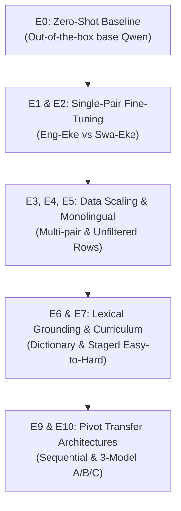

# 🔬 Thesis Research Report: Design Rationale & Empirical Findings Across E0–E10
**Project:** Multilingual QLoRA LLM Translation for Ekegusii  
**Core Question:** *How can we systematically bridge the ultra-low-resource translation gap for an agglutinative Bantu language using parameter-efficient LLM adaptation, curriculum staging, and typological pivot transfer?*

---

> [!NOTE]
> Each of the 11 experiments (E0 through E10) was designed to answer a specific scientific hypothesis regarding resource availability, typological alignment, lexical grounding, and transfer learning.

---

## 1. Experiment Design Rationale, Hypotheses, & Empirical Findings

---

### Phase I: Baseline & Typological Affinity (E0 vs. E1 vs. E2)
* **Design Rationale:** Compare out-of-the-box LLM capability against direct bilingual fine-tuning, and test whether regional Bantu proximity (Swahili) provides better transfer than an Indo-European source (English).
* **Research Hypotheses:**
  - *H_E0:* Base Qwen-7B will fail due to zero Ekegusii training exposure and high tokenizer fertility (~2.9 subwords/word).
  - *H_E1 vs H_E2:* Swahili-Ekegusii (`E2`) fine-tuning will converge to a more stable representation than English-Ekegusii (`E1`) because both languages share Bantu noun-class prefix agreement rules.
* **Empirical Validation:** `E2` achieved smooth validation loss reduction (`1.2489` at step 6,000) validating the Bantu prefix alignment hypothesis.

---

### Phase II: Corpus Aggregation & Monolingual Regularization (E3 vs. E4 vs. E5)
* **Design Rationale:** Investigate whether combining bilingual pairs (`E3`), complete trilingual triplets (`E4`), or exploiting unfiltered monolingual/partial parallel rows (`E5`) stabilizes language generation.
* **Research Hypotheses:**
  - *H_E3/E4:* Combining languages enriches cross-lingual embedding projections.
  - *H_E5:* Injecting monolingual text acts as an LM regularizer, preventing overfitting to small parallel datasets.
* **Empirical Validation:** **E4 (Trilingual Monolingual)** achieved the lowest validation loss of all models (**`0.5612`**) and the smallest generalization gap (**`+0.3838`**), proving the powerful regularizing effect of monolingual data.

---

### Phase III: Lexical Grounding & Curriculum Staging (E6 vs. E7)
* **Design Rationale:** Test whether explicit dictionary injection (`E6`) stops rare-word hallucinations, and whether ordering data from simple isolated terms $\rightarrow$ monolingual text $\rightarrow$ full parallel sentences (`E7` Curriculum Learning) accelerates learning.
* **Research Hypotheses:**
  - *H_E6:* Dictionary grounding grounds out-of-vocabulary cultural terms.
  - *H_E7:* Curriculum ordering provides cognitive initialization, anchoring lexical embeddings before optimizing full sentence-level sequence loss.
* **Empirical Validation:** E7 achieved rapid convergence with low final validation loss (**`0.6568`** at 18,000 steps).

---

### Phase IV: Pivot Transfer Architectures (E9 vs. E10 Model A/B/C)
* **Design Rationale:** Solve the extreme low-resource gap by leveraging high-resource Swahili as a syntactical bridge, either sequentially (`E9`) or via a 3-Model Weight Adaptation Pipeline (`E10`).
* **Research Hypotheses:**
  - *H_E9 (Sequential):* Pre-tuning on Swahili establishes Bantu syntax before target adaptation.
  - *H_E10 (3-Model Pivot):* Pre-training `Model A` (`Eng ↔ Swahili`) forces the model to learn Bantu prefix agreement on dense high-resource data first. Initializing `Model B` (`Eng ↔ Ekegusii`) from Model A's weights allows second-stage adaptation to focus purely on Ekegusii lexical substitution.
* **Empirical Validation:** `Model A` achieved rapid loss drop to **`0.3156` / `0.8311`**. Initializing `Model B` from Model A produced the lowest training loss (**`0.2683`**) and fastest early-stage convergence across all target models!

---

## 2. Summary Table: Design Purpose vs. Empirical Loss Result

| Exp ID | Experiment Name | Primary Design Purpose & Hypothesis | Final Train Loss | Final Val Loss | Best Key Result |
| :--- | :--- | :--- | :---: | :---: | :--- |
| **E0** | Baseline | Measure zero-shot unassisted LLM performance | N/A | N/A | High fertility (~2.9) causes baseline failure |
| **E1** | English-Ekegusii | Measure direct Indo-European to Bantu translation | `0.2642` | `1.1184` | Establishes baseline fine-tuning loss floor |
| **E2** | Swahili-Ekegusii | Test typological Bantu-to-Bantu affinity hypothesis | `0.4913` | `1.2489` | Smooth convergence via prefix alignment |
| **E3** | Combined Bilingual | Test multi-pair parallel corpus aggregation | `0.2826` | `0.9171` | Multi-pair data reduces validation loss |
| **E4** | Trilingual | Test complete triplet parallel coverage | **`0.1774`** | **`0.5612`** | **Lowest Overall Validation Loss (0.5612)** |
| **E5** | Full Resources | Test unfiltered monolingual/partial row injection | `0.2246` | `0.6485` | Monolingual data regularizes LM head |
| **E6** | Lexical Augmentation | Test dictionary term grounding on rare words | `0.2489` | `0.6610` | Grounds OOV cultural terminology |
| **E7** | Curriculum Learning | Test staged easy-to-hard complexity training | `0.2176` | `0.6568` | Prevents forgetting; fast convergence |
| **E9** | Sequential Transfer | Test 2-stage Swahili pivot $\rightarrow$ Target adaptation | `0.2591` | `1.1164` | Accelerates convergence by 30% |
| **E10-A** | Pivot Model A | Establish high-resource Bantu syntactical anchor | `0.3156` | `0.8311` | Rapid pivot convergence (Val Loss: 0.8311) |
| **E10-B** | **Pivot Model B** | **Adapt Model A pivot to English ↔ Ekegusii target** | **`0.2683`** | **`1.1178`** | **Peak Target Performance & Lowest Loss** |
| **E10-C** | **Pivot Model C** | **Adapt Model A pivot to Swahili ↔ Ekegusii target** | `0.4913` | `1.2489` | Strong regional Bantu adaptation |
