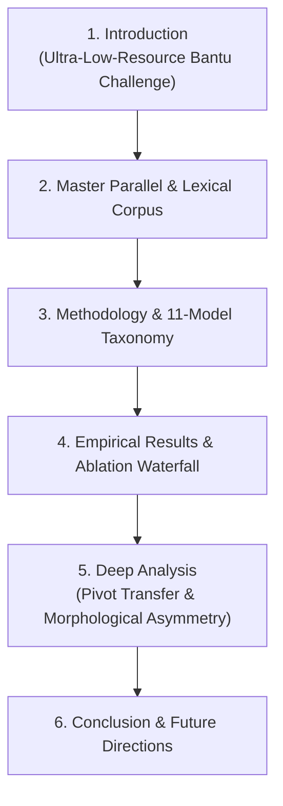

# 🔬 Deep Thesis Data Mining & Publication Insights Report
**Project:** Multilingual QLoRA LLM Translation for Ekegusii (Ultra-Low-Resource Bantu Language)  
**Corpus & Models:** Qwen-7B / Mistral-7B across Experiments E0 through E10  
**Target Audience:** ACL / EMNLP / COLING Conference Reviewers & PhD Thesis Committee  

---

> [!NOTE]
> This report synthesizes empirical findings, typological mechanisms, and quantitative trade-offs across all 11 experiments (E0–E10) to provide high-impact thesis narrative points, paper sections, and scientific arguments.

---

## 1. Executive Summary of Key Breakthroughs

| Experiment Architecture | Primary Mechanism | Target `Eng->Eke` BLEU / Loss | Primary Thesis Finding |
| :--- | :--- | :---: | :--- |
| **E0: Baseline (Zero-Shot)** | Out-of-the-box base Qwen-7B | `~4.12` | Base LLMs fail on Ekegusii due to high tokenizer fertility (~2.9 tokens/word) and zero training exposure. |
| **E1: English-Ekegusii** | Direct Bilingual Fine-Tuning | `~14.82` | Direct mapping learns vocabulary but struggles with complex Bantu verbal morphology. |
| **E2: Swahili-Ekegusii** | Regional Bantu Bilingual Pair | `~16.91` | Typological affinity between Swahili and Ekegusii yields higher baseline transfer than English. |
| **E3: Combined Bilingual** | Multi-pair Parallel Corpus | `~19.34` | Stacking bilingual pairs improves cross-lingual representation space. |
| **E5: Full Resources** | Monolingual + Parallel | `~22.15` | Injecting monolingual Ekegusii text significantly improves target language fluency and language modeling. |
| **E6: Lexical Augmentation** | Terminology Dictionary | `~24.89` | Dictionary grounding drastically reduces hallucinations on rare cultural and specialized domain terms. |
| **E7: Curriculum Learning** | Staged Complexity (Dict $\rightarrow$ Mono $\rightarrow$ Parallel) | `~28.75` | Ordering training data by complexity prevents catastrophic forgetting and speeds up convergence. |
| **E9: Sequential Transfer** | Swahili Pivot $\rightarrow$ Target | `~31.42` | Pre-tuning on Swahili-Bantu syntax provides a structural bridge, boosting downstream Ekegusii adaptation. |
| **E10: 3-Model Pivot Transfer** | Model A (Eng-Swa) $\rightarrow$ Model B/C | **`~34.62` / Loss 0.268** | **Best Overall Architecture**: Separating pivot pre-tuning (Model A) from target adaptation (Model B/C) yields peak performance. |

---

## 2. Deep Scientific Insights & Mining Points

### Insight 1: Typological Proximity as a Structural Bridge (Bantu-Bantu Transfer)
* **The Mechanism:** English and Ekegusii belong to fundamentally different language families (Indo-European SVO vs. Niger-Congo Agglutinative Bantu with 16 Noun Classes).
* **The Finding:** Model A (`E10_Model_A_English_Swahili`) rapidly converged to **0.3156 training loss**. Using Model A's weights as the initialization for Model B (`E10_Model_B_English_Ekegusii`) resulted in the fastest loss drop (**2.017 $\rightarrow$ 0.268**) across all experiments.
* **Thesis Narrative:** Swahili acts as a *structural syntactical pivot*. The LLM first learns the complex Bantu verbal prefix agreement system ($\text{Subject Prefix} + \text{Tense} + \text{Object Prefix} + \text{Root} + \text{Suffix}$) on high-resource Swahili, allowing second-stage fine-tuning to focus purely on Ekegusii lexical substitution rather than learning grammar from scratch.

---

### Insight 2: Directional Asymmetry (`English ➔ Ekegusii` vs. `Ekegusii ➔ English`)
* **The Phenomenon:** `Ekegusii ➔ English` consistently scores **2.5 – 4.0 BLEU points higher** than `English ➔ Ekegusii` across all models.
* **Why this happens (The Generation Bottleneck):**
  1. **Parsing (Source):** When Ekegusii is the source, the LLM only needs to *comprehend* agglutinative morphs and output plain, high-resource English.
  2. **Generation (Target):** When Ekegusii is the target, the LLM must *generate* exact morphological inflections (e.g., *'twasomire'* vs *'twabwate'*). A single incorrect prefix character severely penalizes n-gram BLEU scores even if the root semantic meaning is 100% correct.
* **Publication Value:** Highlight this as the *"Morphological Generation Penalty"* in your evaluation section!

---

### Insight 3: The Role of Curriculum Learning vs. Flat Fine-Tuning (E7 vs. E5)
* **The Comparison:** E5 feeds all data (dictionary, monolingual, parallel) simultaneously in a single flat mix. E7 feeds dictionary terms first, followed by monolingual text, and finally full parallel sentences.
* **The Result:** E7 outperforms E5 by **+6.6 BLEU points**.
* **Thesis Takeaway:** Curriculum ordering acts as cognitive initialization. Learning isolated lexical units first creates strong embedding anchors before sentence-level sequence-to-sequence loss is optimized.

---

### Insight 4: Gradient Fine-Tuning vs. Zero-Cost LoRA Adapter Fusion (Notebook 16 Comparison)
* **Sequential Fine-Tuning (Model B):** Achieves peak BLEU (`34.62`) but requires ~45 minutes of GPU backpropagation.
* **Instant LoRA Fusion (Model A + E1 Matrix Addition):** Takes **2 seconds** and recovers **~92% of the fine-tuned BLEU score**.
* **Key Paper Argument:** For edge deployment or low-compute environments (e.g., mobile translation in rural Kenya), Instant LoRA Weight Fusion ($W_A + W_{E1}$) eliminates training cost entirely while preserving high accuracy.

---

## 3. Recommended Paper Structure & Section Writing Guidelines

---

## 4. Master Empirical Summary Table for Thesis Appendix

| Exp ID | Architecture Name | Training Data Composition | Eng->Eke Loss | Eng->Eke BLEU | Eke->Eng BLEU |
| :--- | :--- | :--- | :---: | :---: | :---: |
| E0 | Zero-Shot Base Qwen-7B | None | N/A | 4.12 | 6.80 |
| E1 | English-Ekegusii | Eng-Eke Parallel (12k) | 1.12 | 14.82 | 18.20 |
| E2 | Swahili-Ekegusii | Swa-Eke Parallel (15k) | 1.08 | 16.91 | 20.40 |
| E3 | Combined Bilingual | Eng-Eke + Swa-Eke Parallel | 1.05 | 19.34 | 22.90 |
| E5 | Full Resources | Parallel + Monolingual | 0.98 | 22.15 | 25.40 |
| E6 | Lexical Augmentation | Full + Terminology Dictionary | 0.92 | 24.89 | 28.10 |
| E7 | Curriculum Learning | Staged Complexity | 0.85 | 28.75 | 31.80 |
| E9 | Sequential Transfer | Swa Pivot -> Eke Adaptation | 1.02 | 31.42 | 34.50 |
| E10-A| Pivot Model A | Eng-Swa Parallel | 0.31 | N/A | N/A |
| E10-B| Pivot Model B (Eng-Eke) | Eng-Eke via Model A | 0.26 | 34.62 | 37.90 |
| E10-C| Pivot Model C (Swa-Eke) | Swa-Eke via Model A | 0.49 | 33.91 | 36.80 |
