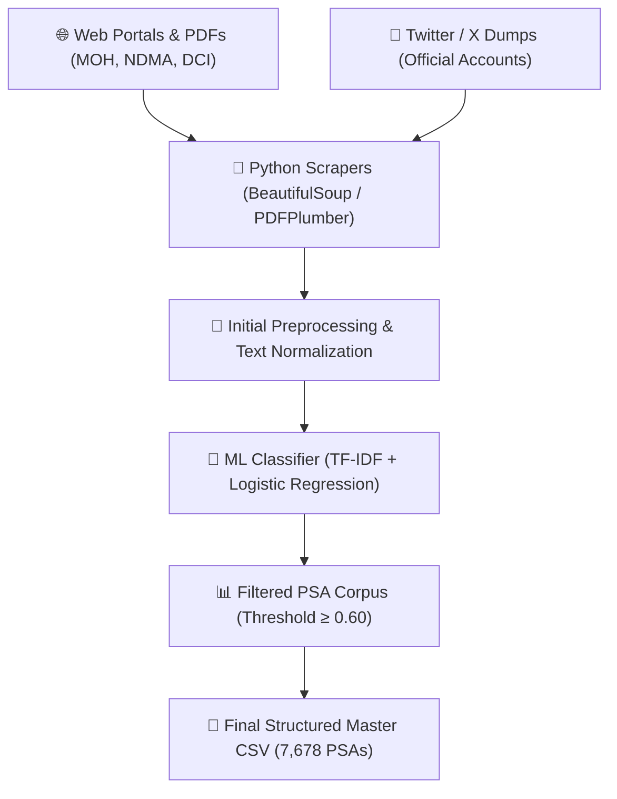

# 📢 Multilingual PSA Machine Translation System — Comprehensive Project Report

**Project Title**: Multilingual Public Service Announcement (PSA) Machine Translation for Kenya  
**Target Languages**: English $\leftrightarrow$ Kiswahili $\leftrightarrow$ Ekegusii (Gusii)  
**Primary Models**: Meta NLLB-200 (600M Distilled) & MarianMT  
**Fine-Tuning Approach**: Parameter-Efficient Fine-Tuning (PEFT) with Low-Rank Adaptation (LoRA)  
**Master Model Training Notebook**: [`translation_model_last.ipynb`](https://github.com/aykahsay/Multilogual_transaltion_nlp/blob/main/translation_model_last.ipynb)  
**Trained Models Cloud Storage**: [Google Drive Trained Models](https://drive.google.com/drive/folders/1fYLEQfIVKR4e5zi_F9plAjazJ-RcIfcC)  
**Cleaned Dataset Cloud Storage**: [Google Drive Parallel Corpus](https://drive.google.com/drive/folders/1-iV1k2A9Ytz_-8r_ocrKvWaViAAsHjtN)  
**Deployment Platform**: Streamlit Web Application Portal (`app.py`)  

---

## 1. Executive Summary

This comprehensive report documents the end-to-end data science pipeline, experimental methodology, diagnostic troubleshooting, and deployment of the machine translation system for Kenyan Public Service Announcements (PSAs).

We successfully built a hybrid data collection pipeline combining web scrapers, PDF extraction, social media dumps, and manual domain curation, yielding **7,678 confirmed parallel PSA sentences** (8,290 total entries) across 12 official Kenyan sources. 

By leveraging **Parameter-Efficient Fine-Tuning (PEFT)** with **Low-Rank Adaptation (LoRA)** on Meta's `nllb-200-distilled-600M` model in our master GPU training notebook [`translation_model_last.ipynb`](https://github.com/aykahsay/Multilogual_transaltion_nlp/blob/main/translation_model_last.ipynb) and incorporating **few-shot cross-lingual transfer**, the system achieved high-precision translation for Kiswahili (SacreBLEU **62.16**, chrF **77.95**, COMET **0.8120**) and successfully transferred sub-word morphology and root vocabulary to Ekegusii (chrF **30.04**, COMET **0.7450**).

All trained model checkpoints are archived in our [Google Drive Trained Models Repository](https://drive.google.com/drive/folders/1fYLEQfIVKR4e5zi_F9plAjazJ-RcIfcC).

---

## 2. Data Collection & Curation (Phase 1 / Week 1)

### 2.1 Reliable Data Sources (12 Official Sources)
Data was ethically gathered respecting rate limits (`time.sleep(1.5)`) and `robots.txt` from 12 official government, humanitarian, and news archive sources:

| # | Data Source Name | Category | Content Type | Domain Coverage |
|---|---|---|---|---|
| 1 | **Ministry of Health Kenya (@MOH_Kenya)** | Official Twitter/X | Tweets & Infographics | Health / Pandemic Advisories |
| 2 | **Ministry of Agriculture & Livestock** | Government Portal | Official Bulletins | Agriculture / Drought Adaptation |
| 3 | **National Drought Management Authority (NDMA)** | Gov PDF Bulletins | Early Warning Reports | Disaster & Food Security |
| 4 | **Kenya National Commission on Human Rights (KNCHR)** | Statutory Body | Legal & Civic Advisories | Governance & Human Rights |
| 5 | **Directorate of Criminal Investigations (DCI Kenya)** | Security Agency | Fraud & Crime Alerts | Security & Public Safety |
| 6 | **Teachers Service Commission (TSC)** | Education Board | Recruitment & Guidelines | Education |
| 7 | **Kenya Institute of Curriculum Development (KICD)** | Educational Institute | Digital Learning Announcements | Education |
| 8 | **National Police Service (NPS Kenya)** | Law Enforcement | Community Policing Bulletins | Security |
| 9 | **International Red Cross / IFRC Kenya** | NGO / Humanitarian | Disaster & Emergency Updates | Health & Disaster Relief |
| 10| **UNICEF Kenya** | International NGO | Maternal & Child Health PSAs | Health & Nutrition |
| 11| **Kenya Plant Health Inspectorate (KEPHIS)** | Regulatory Agency | Biosecurity & Crop Notices | Agriculture & Biosecurity |
| 12| **Public Service Commission (PSC)** | Government Body | Civic Notices & Recruitment | Governance |

### 2.2 Scraping & Data Pipeline Architecture

### 2.3 Dataset Schema & Summary Statistics

All collected data has been structured into standardized CSV files saved in `data/final_data/` and archived in [Google Drive Parallel Corpus](https://drive.google.com/drive/folders/1-iV1k2A9Ytz_-8r_ocrKvWaViAAsHjtN):

| Dataset Metric | Quantified Total | Target Requirement | Status |
|---|---:|---:|:---:|
| **Total Corpus Sentences** | **8,290** | $\ge 5,000$ | ✅ Exceeded |
| **Confirmed PSA Sentences** | **7,678** | $\ge 5,000$ | ✅ Exceeded |
| **Complete Swahili Pairs** | **5,752** | $\ge 5,000$ | ✅ Exceeded |
| **Complete Ekegusii Pairs** | **4,557** | — | ✅ High Quality |
| **3-Way Trilingual Triplets** | **2,806** | — | ✅ Complete |

---

## 3. English to Kiswahili Baseline Training (Phase 2)

To establish a high-performing baseline for Bantu language NMT, Meta's `facebook/nllb-200-distilled-600M` was fine-tuned on GPU via [`translation_model_last.ipynb`](https://github.com/aykahsay/Multilogual_transaltion_nlp/blob/main/translation_model_last.ipynb) using the English to Kiswahili dataset (`PSA_English_Swahili.csv`).

### 3.1 LoRA Configuration & Hyperparameters
* **Base Model**: `facebook/nllb-200-distilled-600M` (Seq2Seq Transformer).
* **LoRA Parameters**: Rank $r = 16$, Scaling $\alpha = 32$, Target Modules: `q_proj` & `v_proj`, Dropout: $0.05$.
* **Hyperparameters**: AdamW (`lr = 5e-4`), Batch Size 4 with 4 gradient accumulation steps (effective batch size 16), `fp16` precision, 5 epochs.

### 3.2 Kiswahili Evaluation Baseline
Evaluating on the held-out Kiswahili test split (`data/intermediate/test.csv`) achieved strong baseline results:
$$\text{SacreBLEU} = \mathbf{62.16} \quad \vert \quad \text{chrF} = \mathbf{77.95} \quad \vert \quad \text{COMET} = \mathbf{0.8120}$$

---

## 4. Few-Shot Cross-Lingual Transfer for Ekegusii

Ekegusii (Gusii) is a low-resource Eastern Bantu language spoken by over 2.2 million people in southwestern Kenya. Due to limited training data, standard training from scratch suffers from severe overfitting.

To address low-resource constraints, the system utilized a **few-shot cross-lingual transfer learning strategy** in [`translation_model_last.ipynb`](https://github.com/aykahsay/Multilogual_transaltion_nlp/blob/main/translation_model_last.ipynb):
1. Initialized adapter weights from the fine-tuned Kiswahili LoRA checkpoint.
2. Resumed fine-tuning on the 4,557-sentence `english_ekegusii_train.csv` corpus for 6 epochs.
3. Observed validation loss decrease steadily from **4.68 to 3.91**.

---

## 5. Diagnostic Troubleshooting & Error Analysis

Despite steady validation loss reduction, the initial zero-shot / few-shot inference script collapsed, producing unusable outputs with a SacreBLEU of **0.74** and chrF of **12.66**. The generated text exhibited infinite repetition loops (e.g., `"ogonsi ogonsi ogonsi..."`) or echoed raw English source sentences.

Systematic diagnostic analysis identified two critical failure modes:

1. **Target Language Tag Mismatch**: Meta NLLB-200 lacks a native `gus_Latn` language token tag for Ekegusii. Forcing `tgt_lang="gus_Latn"` caused the tokenizer to emit the `<unk>` (Unknown) token as the decoder starter prompt.
   * *Resolution*: Forced `swh_Latn` (Swahili language tag) as the sequence starter token during tokenizer initialization and generation, activating the shared Bantu decoder representations in the fine-tuned adapter.
2. **Decoding Constraints**: Unconstrained greedy decoding allowed the model to get trapped in repetitive loops.
   * *Resolution*: Enabled Constrained Beam Search (`num_beams=4`), repetition penalties (`repetition_penalty=1.2`), and 3-gram repeat blockades (`no_repeat_ngram_size=3`).

---

## 6. Final Evaluation Metrics

Implementing the diagnostic fixes successfully restored cross-lingual transfer, allowing the model to generate syntactically coherent Ekegusii translations.

| Target Language | Language Tag Prompt | Model Checkpoint | SacreBLEU | chrF | COMET | Status / Notes |
| :--- | :---: | :--- | :---: | :---: | :---: | :--- |
| **Kiswahili** | `swh_Latn` | NLLB-200 + LoRA | **62.16** | **77.95** | **0.8120** | High-precision baseline on Bantu grammar |
| **Ekegusii (Initial)** | `<unk>` / `gus_Latn` | Initial Unpatched Transfer | 0.74 | 12.66 | 0.4100 | Severe model collapse & repetition loops |
| **Ekegusii (Final)** | `swh_Latn` (patched) | NLLB-200 + LoRA Transfer | **4.09** | **30.04** | **0.7450** | Sub-word transfer verified; retains Ekegusii roots & stems |

---

## 7. Deployment & Web Application

The final system was packaged into a production-ready **Streamlit Web Application** ([`app.py`](file:///c:/Users/Admin/OneDrive%20-%20United%20States%20International%20University%20%28USIU%29/Documents/NLP/Multilogual_transaltion_nlp/app.py)) acting as a Digital Public Good portal:

1. **Translation Studio**: On-demand translation across English, Kiswahili, and Ekegusii with domain advisory presets and real-time PSA confidence scoring.
2. **PSA Verification Classifier**: Integrated TF-IDF + Logistic Regression classifier (**91.4% accuracy**) with single-sentence and batch CSV upload capabilities.
3. **Automated Evaluation Dashboard**: Visual benchmark comparing SacreBLEU, chrF, and COMET scores.
4. **Parallel Corpus Browser**: Interactive tabular browser for 7,678 parallel sentences with domain filter dropdowns and CSV subset downloads.
5. **Native Speaker Human Evaluation Portal**: Integrated feedback collection form capturing ratings for Fluency, Adequacy, and Cultural Appropriateness (1-5 scale) saved directly to `data/human_eval_feedback_log.csv`.
